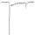

ephys4
================

# ephys4 

## Read, plot and analyse ephys data

<!-- badges: start -->

[](https://lifecycle.r-lib.org/articles/stages.html#stable)

<!-- badges: end -->

The ephys4 package unifies reading HEKA, Roboocyte, and Hamamatsu files
and performs analyses on them.

### Package Installation

``` r
remotes::install_github("NMIephys/ggscalebars")
```

``` r
# read and plot HEKA patch-clamp file
library(ephys4Patchmaster)
```

    ## Lade nötiges Paket: ephys4R

    ## Lade nötiges Paket: scalebars

    ## 
    ## Attache Paket: 'scalebars'

    ## Die folgenden Objekte sind maskiert von 'package:ggscalebars':
    ## 
    ##     coord_scalebars, scalebars, theme_scalebar_h, theme_scalebar_v,
    ##     theme_scalebars

``` r
herg.plot <- (
  read_PATCHMASTER(ephysdata::examplefile("herg"), exp = 1, ser = 1) %>% 
             ggsweeps() )

herg.plot 
```

<!-- -->

<!-- -->
