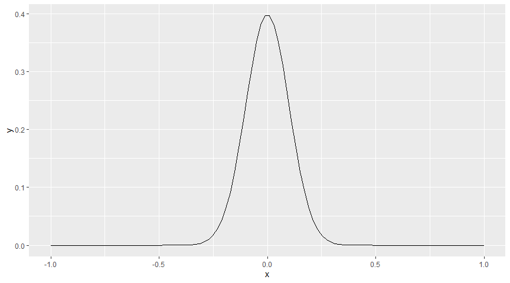
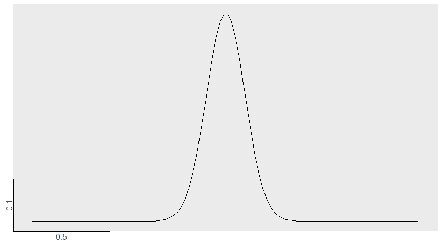

ggscalebars
================

<!-- badges: start -->

[](https://lifecycle.r-lib.org/articles/stages.html#stable)

<!-- badges: end -->

Scalebars are commonly used as alternatives to classical axes. This
package provides scalebars for ggplot.

### Package Installation

``` r
remotes::install_github("NMIephys/ggscalebars")
```

``` r
x=seq(-10,10, length.out=100)
testdata <- data.frame(x=x/10, y=dnorm(x))
p<- ggplot(testdata, aes(x,y)) + geom_line()

p
```

<!-- -->

``` r
p + scalebars(ylength=.1)
```

<!-- -->
